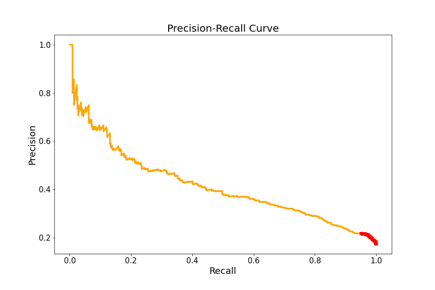

# Cancer Image Recognition

## Table of Contents
1. [Introduction](#introduction)
    - [Background](#background)
    - [AWS Setup](#aws-setup)
    - [Data](#data)
        - [Web scrapping](#web-scrapping)
        - [Data Cleaning](#data-cleaning)

2. [Exploratory Data Analysis](#exploratory-data-analysis)
    - [Sample images](#sample-images)
    - [Imbalanced Data](#imbalanced-data)

3. [Pipeline](#pipeline)
    - [Base Model](#base-model)
<!--     - [Basic Pipeline](#basic-pipeline) -->
    - [Transfer Learning](#transfer-learning)

4. [Model Evaluation](#model-evaluation)
    - [ROC AUC Curve](#roc-auc-curve)
    - [Precision-Recall Curve](#precision-recall-curve)
    - [F1 Score](#f1-score)
    - [Confusion Matrix](#confusion-matrix)
    - [Application](#application)

5. [Future works](#future-works)
    - [Possible ways to improve pipeline](#possible-ways-to-improve-pipeline)
    - [Build App](#build-app)

- [Built with](#built-with)
- [Author](#author)

---

## Introduction

### Background
Cancer is one of the leading causes of death in the world. The World Health Organization (WHO) [estimates](https://www.who.int/news-room/fact-sheets/detail/cancer) that cancer was responsible for 9.6 million deaths globally in 2018. Globally, about 1 in 6 deaths is due to cancer. 
Studies consistently [show](https://www.who.int/news-room/detail/03-02-2017-early-cancer-diagnosis-saves-lives-cuts-treatment-costs) that early cancer diagnosis saves lives and cuts treatment costs . 

I wanted to be a part of the solution in helping people detect cancer early. So I decided to build a skin cancer recognition model using 23.9K images from the [International Skin Imaging Collaboration (ISIC)](https://www.isic-archive.com/#!/topWithHeader/onlyHeaderTop/gallery). The images were all moles in the skin that were labeled either melanoma or not. 

### AWS Setup
Since I was dealing with large sets of image data, I decided to set up AWS EC2 instances to process and store the images. I decided to set up 2 [t3.2xlarge](https://aws.amazon.com/ec2/instance-types/t3/) server instances with 150 GB of storage. One instance was for building the neural network pipeline and another was for training the pipeline on the image dataset. By having 2 server instances, I could build and run the pipeline simultaneously. 

### Data

#### Web scrapping
I’ve scraped the 23.K images from the [ISIC](https://www.isic-archive.com/#!/topWithHeader/onlyHeaderTop/gallery) website. You can find the code I used for web scrapping [here](0.&#32;Data&#32;extraction&#32;and&#32;cleaning.ipynb).  

After scrapping the images, I ended up having 53 GB worth of images with a [metadata](data/metadata.csv) that had the labeled information. With my AWS setup, it took about 2 hours to download all the images.

#### Data Cleaning
The images had inconsistent sizes so I resized them all to 100 x 100 pixel dimensions. 

I split my training and test set with a 80:20 split and ended up with the below ratio.

There were 249 images (roughly 1% of the entire dataset) that didn’t have labels to indicate if the patient had cancer or not.  So I decided to drop those images and ended up with a total of 23,653 images.  

- **Train Set: 18,922 images**
- **Test Set: 4,731 images**

---

## Exploratory Data Analysis

### Sample images
Here are a few samples of cancerous and non-cancerous mole images after resizing. As you can see, it is difficult to distinguish cancerous moles from a human eye. 

### Imbalanced Data
I quickly realized that my dataset was imbalanced. Roughly 91% were non-cancerous and only 9% were cancerous. This imbalance makes sense because only a small proportion of the population have cancer at a given time. 

To work with these imbalanced datasets, I decided to adjust the `class_weights` parameter in the `fit` method in `keras`. If I didn’t have enough images, I may have considered oversampling the minority class by augmenting the images in `keras`.

---

## Pipeline

My objective of this project was to have a [recall](https://en.wikipedia.org/wiki/Precision_and_recall) higher than 95% and optimize the [F1 score](https://en.wikipedia.org/wiki/F1_score) as much as possible. The cost of false negatives  (predicted non-cancerous, but was actually cancerous) were extremely high so I wanted to stick with a model to keep a high recall rate over [precision](https://en.wikipedia.org/wiki/Precision_and_recall). 

Below is the [confusion matrix](https://en.wikipedia.org/wiki/Confusion_matrix) for reference.

### Base Model

I started off my project with a baseline model so I would have something to compare to. I used a simple method that would randomly classify images with the same ratio of non-cancerous (90.8%) and cancerous (9.2%). 

With this randomized model, I got a **recall 7.8%,  precision 8.4%, and a F1 score 5.9%**. The below confusion matrix was the predicted total counts.

This random model was missing most of the cancerous images and fell extremely short of the desired 95% recall rate. This result wasn’t surprising because it was randomly predicted in an imbalanced dataset. 

<!-- If I have time

### Basic Pipeline

 -->

### Transfer Learning

After numerous repetition on building/editing my convolutional neural network, I ended up  
incorporating transfer learning using [VGG16](https://keras.io/api/applications/vgg/#vgg16-function).  I remove the last 2 layers with my model with a `sigmoid` activation. You can view the code [here](2.&#32;All&#32;Data&#32;Modeling) for details. 

Here are the accuracy, loss, and recall score after each epoch. With my current AWS instance, each epoch took me about 5.5 minutes so with 20 epochs, it took me about 2 hours to run. 

I was able to observe that the accuracy and loss were steadily improving. I can probably increase the number of epochs to improve my score in the future.

## Model Evaluation

### ROC AUC Curve
My transfer learning model got an area under the curve (AUC) score of **0.882**. This indicates that my model is overall performing well in distinguishing the correct classes.  

### Precision-Recall Curve
The graph below is my model’s Precision-Recall Curve.  The area highlighted in red are all recalls higher than 95%. As mentioned earlier, I’m building a model that has a recall of 95% or higher. Given that 95% threshold mark, the most liberal threshold I have for more my model is **0.022247791**. 

### F1 Score

### Confusion Matrix

### Application

---

## Future works

### Possible ways to improve pipeline

### Build App

---

## Built With

* **Software Packages:**  [Python](https://www.python.org/),  [Pandas](https://pandas.pydata.org/docs/), [Numpy](https://numpy.org/), [Beautiful Soup](https://www.crummy.com/software/BeautifulSoup/), [Scikit-Learn](https://scikit-learn.org/), [Matplotlib](https://matplotlib.org/), [Scipy](https://docs.scipy.org/doc/), [Seaborn](https://seaborn.pydata.org/)
* **Prediction Methods:** Gradient Boosting, Random Forest, XGBoost, Ada Boost, Random Forest.
## Author

* **Takeshi Sugiyama** - *Data Scientist*
  * [Linkedin](https://www.linkedin.com/in/takeshi-sugiyama/)
  * [Tableau](https://public.tableau.com/profile/takeshi.sugiyama)